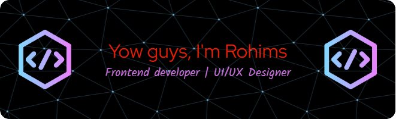

<!-- ## Hello everyone 👋
##### I'm Abdur Rohim 🙏😁 -->

<!-- **RohimS7/RohimS7** is a ✨ _special_ ✨ repository because its `README.md` (this file) appears on your GitHub profile. -->

### About me:

- 🔭 I’m currently studying on University of Brawijaya, Faculty Vokasi, Program Study Information Technology
- 🌱 I’m currently learning HTML, CSS, C++, Java, JavaScript, Laravel, PHP, Flutter, Dart, MySQL, PHPMyAdmin, Canva, Figma
- 👯 I’m looking to collaborate on ...
- 🤔 I’m looking for help with ...
- 💬 Ask me about web programming and design
- 📫 How to reach me: ...
- 😄 Pronouns: he/him
- ⚡ Fun fact: eat a lot but don't get fat

### My skills

           

### The AI i use

 

### Contact

  

### My Github Stats

<!-- ##### 💫 About Me:
🔭 I’m currently studying on University of Brawijaya, Faculty Vokasi, Program Study Information Technology 🌱 I’m currently learning HTML, CSS, C++, Java, JavaScript, Laravel, PHP, Flutter, Dart, MySQL, PHPMyAdmin, Canva, Figma 👯 I’m looking to collaborate on ... 🤔 I’m looking for help with ... 💬 Ask me about web programming and design 📫 How to reach me: ... 😄 Pronouns: himsdev ⚡ Fun fact: eat a lot but don't get fat

##### 🌐 Socials:
  

##### 💻 Tech Stack:
                    
##### 📊 GitHub Stats:
 
 

##### 🏆 GitHub Trophies

##### 🔝 Top Contributed Repo

---
 -->

<!-- Proudly created with GPRM ( https://gprm.itsvg.in ) -->

### Play games kuy
<picture>
  <source media="(prefers-color-scheme: dark)" srcset="https://raw.githubusercontent.com/RohimS7/RohimS7/output/pacman-contribution-graph-dark.svg">
  <source media="(prefers-color-scheme: light)" srcset="https://raw.githubusercontent.com/RohimS7/RohimS7/output/pacman-contribution-graph.svg">
  
</picture>

###

###

  

###

btw stats nya jelek banget aslii😅
keliatan banget ngga pernah commit🤡
